# System Functional Documentation

## Historical Mutual Fund Data Platform

**Version**: Current (as of February 2026)  
**Database**: SQLite (`funds.db`) — ~42 million NAV rows, ~8,200 schemes, April 2006 – present  
**Data Source**: AMFI (Association of Mutual Funds in India) daily NAV reports

---

## Table of Contents

1. [System Overview](#1-system-overview)
2. [Architecture](#2-architecture)
3. [Directory Structure](#3-directory-structure)
4. [Data Pipeline](#4-data-pipeline)
5. [Database Schema](#5-database-schema)
6. [Backend (Performance Attribution API)](#6-backend--generation-2-amc-track-record-api)
7. [Frontend (Performance Attribution UI)](#7-backend--generation-3-performance-attribution-api)
8. [UI Concepts Prototype](#10-ui-concepts-prototype)
9. [CI/CD Pipeline](#11-cicd-pipeline)
10. [Configuration & Environment Variables](#12-configuration--environment-variables)
11. [Dependencies](#13-dependencies)
12. [Metrics & Formulas Reference](#14-metrics--formulas-reference)
13. [End-to-End Data Flow](#15-end-to-end-data-flow)
14. [Development Setup](#16-development-setup)

---

## 1. System Overview

This platform is a multi-layer application for analysing historical NAV (Net Asset Value) data for Indian mutual funds. It ingests daily NAV data published by AMFI, stores it in a SQLite database, and exposes two independent analytics APIs backed by two independent React frontends. The system enables investors and analysts to:

- Compare AMC (Asset Management Company) track records across risk-adjusted return metrics
- Analyse rolling returns of individual funds against user-selected index benchmarks
- Quantify expense drag between Direct and Regular plan variants
- Measure market capture, drawdown, and performance attribution statistics

The codebase has evolved through three generations, with Gen 3 now the primary active system:

| Generation | Backend | Frontend | Focus | Status |
|---|---|---|---|---|
| Gen 1 | Python data pipeline | — | Raw data ingestion only | Active (data pipeline) |
| Gen 2 | *(removed)* | *(removed)* | AMC-level track record comparison | Removed |
| Gen 3 | `backend/` (port 8001) | `frontend/` | Fund-level rolling return & performance attribution | **Active** |

---

## 2. Architecture

```mermaid
graph TD
    AMFI["🌐 AMFI Website\nportal.amfiindia.com\nDaily NAV CSVs since Apr 2006"]

    FETCH["📥 amfi_fetch.py\nIterates Apr 2006 → today\nDownloads one CSV per trading day"]

    CSV["📁 data/YYYY/MM/DD.csv\nRaw semicolon-delimited NAV files\n~19 years of history"]

    PROC["⚙️ amfi_data_process.py\nParses CSVs\nInserts into SQLite via db_util.py"]

    DB[("🗄️ funds.db\nSQLite Database\n~42M rows · ~8,200 schemes\nscheme_data · nav_data · isin_data")]

    BE3["🔧 backend/\nFastAPI  :8001\nPerformance Attribution API\nRolling Returns · Drawdown · Capture Ratios"]

    FE3["🖥️ frontend/\nReact  :5173\nFund vs Benchmark Analysis\nRecharts · TailwindCSS"]

    CONCEPTS["🎨 frontend-ui-concepts/\nDesign Prototypes\nTerminal & Editorial concepts"]

    GHA["🤖 GitHub Actions\nDaily cron 19:00 UTC\nFetch → Process → Commit → Release"]

    AMFI -->|"HTTP GET (daily)"| FETCH
    FETCH -->|"writes CSV"| CSV
    CSV -->|"parsed by"| PROC
    PROC -->|"INSERT OR IGNORE"| DB
    GHA -->|"orchestrates"| FETCH
    GHA -->|"commits CSV + publishes funds.db.tar.gz"| DB

    DB -->|"SQLite queries"| BE3

    BE3 -->|"REST API"| FE3
    BE3 -.->|"shared API"| CONCEPTS

    style DB fill:#f0f4ff,stroke:#4a6cf7
    style AMFI fill:#fff3e0,stroke:#f57c00
    style GHA fill:#e8f5e9,stroke:#388e3c
    style FE3 fill:#fce4ec,stroke:#c2185b
    style CONCEPTS fill:#f3e5f5,stroke:#7b1fa2
```



---

## 3. Directory Structure

```
historical-mf-data/
│
├── .github/
│   └── workflows/
│       └── amfi-data-update.yml       # Daily GitHub Actions workflow
│
├── src/
│   ├── SQLite.sql                     # Ad-hoc SQL scratch queries
│   └── amfi/
│       ├── amfi_fetch.py              # Downloads daily NAV CSVs from AMFI
│       ├── amfi_data_process.py       # Parses CSVs and inserts into SQLite
│       ├── db_util.py                 # SQLite schema creation and CRUD utilities
│       └── funds.db                   # Local dev copy of the database
│
├── data/                              # Raw CSV files: data/YYYY/MM/DD.csv
│
├── docs/
│   └── analysis_ideas.md             # 10 analysis ideas for finance professionals
│
├── backend/                           # Performance Attribution API (port 8001)
│   ├── requirements.txt
│   └── app/
│       ├── main.py
│       ├── config.py
│       ├── database.py
│       ├── models/
│       │   └── performance.py
│       ├── routers/
│       │   ├── schemes.py
│       │   └── performance.py
│       └── services/
│           ├── rolling_returns.py
│           ├── analytics.py
│           └── benchmarking.py
│
├── frontend/                          # Performance Attribution UI (port 5173)
│   ├── package.json
│   ├── vite.config.js
│   └── src/
│       ├── App.jsx
│       ├── components/
│       ├── hooks/
│       └── services/
│
├── backend/                     # Gen 3: Performance Attribution API (port 8001)
│   ├── requirements.txt
│   └── app/
│       ├── main.py
│       ├── config.py
│       ├── database.py
│       ├── models/
│       │   └── performance.py
│       ├── routers/
│       │   ├── schemes.py
│       │   └── performance.py
│       └── services/
│           ├── rolling_returns.py
│           ├── analytics.py
│           └── benchmarking.py
│
├── frontend/                          # Gen 2: AMC Analysis UI (port 3000)
│   ├── package.json
│   ├── vite.config.js
│   └── src/
│       ├── App.jsx
│       ├── components/
│       ├── hooks/
│       ├── services/
│       └── utils/
│
├── frontend/                    # Gen 3: Performance Attribution UI
│   ├── package.json
│   ├── vite.config.js
│   └── src/
│       ├── App.jsx
│       ├── components/
│       ├── hooks/
│       └── services/
│
├── frontend-ui-concepts/              # UI design explorations (non-production)
│   ├── package.json
│   └── src/
│       ├── concepts/1-terminal/       # Dark, data-dense terminal aesthetic
│       └── concepts/2-editorial/      # Light, magazine-style editorial aesthetic
│
├── create_test_db.py                  # Generates a synthetic test funds.db
├── requirements.txt                   # Root Python deps: requests only
├── funds.db                           # Production SQLite database (gitignored)
├── backlog.md                         # 15 detailed analysis ideas with mermaid diagrams
├── metrics.md                         # Complete metrics reference with formulas
└── README.md
```

---

## 4. Data Pipeline

### 4.1 Data Fetcher — `src/amfi/amfi_fetch.py`

**Purpose**: Download one CSV file per calendar day from AMFI starting April 1, 2006 through today.

**Behaviour**:
- Iterates over every date from `01-Apr-2006` to `datetime.today()`
- For each date, performs an HTTP GET to:
  ```
  https://portal.amfiindia.com/DownloadNAVHistoryReport_Po.aspx?frmdt=<DD-MMM-YYYY>
  ```
- Saves the response body to `data/YYYY/MM/DD.csv`
- Skips dates where the file already exists (resumable)
- Skips non-trading days (AMFI returns empty response for weekends/holidays)

**Output**: `data/YYYY/MM/DD.csv` — semicolon-delimited with headers:
```
Scheme Code;ISIN Div Payout/ ISIN Growth;ISIN Div Reinvestment;Scheme Name;Net Asset Value;Date
```

### 4.2 Data Processor — `src/amfi/amfi_data_process.py`

**Purpose**: Walk all downloaded CSV files and populate the SQLite database.

**Behaviour**:
- Walks the `data/` directory tree recursively
- For each CSV file: reads lines, skips category headers (lines without semicolons in numeric fields), parses each data row
- Calls `db_util.insert_scheme()`, `db_util.insert_nav()`, `db_util.insert_isin()` for each record
- Idempotent — uses `INSERT OR IGNORE` to avoid duplicates

### 4.2.1 Data Pipeline Flowchart


### 4.3 Database Utilities — `src/amfi/db_util.py`

**Functions**:

| Function | Description |
|---|---|
| `create_schema(conn)` | Creates `scheme_data`, `nav_data`, `isin_data` tables if not exist |
| `insert_scheme(conn, code, name)` | Inserts scheme with `INSERT OR IGNORE` |
| `insert_nav(conn, code, date, nav)` | Inserts NAV record |
| `insert_isin(conn, code, isin_payout, isin_reinvest)` | Inserts ISIN record |
| `create_indexes(conn)` | Creates performance indexes after bulk load |

### 4.4 Test Database Generator — `create_test_db.py`

**Purpose**: Create a synthetic `funds.db` for development and testing without the full production dataset.

**Generates**:
- 11 schemes: HDFC, ICICI, SBI, Kotak, Axis Equity, Nifty 50, and variants
- Random NAV data from 2020-01-01 to 2024-12-31 (random walk simulation)
- Realistic scheme names following AMFI naming conventions

---

## 5. Database Schema

**Database Engine**: SQLite  
**File**: `funds.db` (root-level, gitignored; `src/amfi/funds.db` for local dev)

### 5.1 Tables

#### `scheme_data`
```sql
CREATE TABLE scheme_data (
    scheme_code INTEGER PRIMARY KEY,
    scheme_name TEXT NOT NULL
);
```
- `scheme_code`: AMFI-assigned numeric scheme identifier (unique per scheme)
- `scheme_name`: Full scheme name as published by AMFI (e.g., `"HDFC Flexi Cap Fund - Direct Plan - Growth Option"`)

#### `nav_data`
```sql
CREATE TABLE nav_data (
    scheme_code INTEGER NOT NULL,
    date        DATE    NOT NULL,
    nav         REAL    NOT NULL,
    FOREIGN KEY (scheme_code) REFERENCES scheme_data(scheme_code)
);
```
- One row per scheme per trading day
- `nav`: Net Asset Value in INR (Indian Rupees), stored as floating-point

#### `isin_data`
```sql
CREATE TABLE isin_data (
    scheme_code        INTEGER,
    isin_payout        TEXT,
    isin_reinvestment  TEXT,
    FOREIGN KEY (scheme_code) REFERENCES scheme_data(scheme_code)
);
```
- ISINs are optional; many schemes lack them in AMFI data

### 5.2 Entity-Relationship Diagram


**Index coverage:**

| Index | Table | Columns | Purpose |
|---|---|---|---|
| `scheme_code_index` | `scheme_data` | `scheme_code` | Primary lookup |
| `date_index` | `nav_data` | `(scheme_code, date)` | Time-series range queries — most critical |
| `isin_index1` | `isin_data` | `scheme_code` | Join from scheme |
| `isin_index2` | `isin_data` | `isin_payout` | Lookup by ISIN |
| `isin_index3` | `isin_data` | `isin_reinvestment` | Lookup by ISIN |

### 5.3 Scale

| Metric | Value |
|---|---|
| Total schemes | ~8,200 |
| Total NAV rows | ~42 million |
| Date range | April 2006 – present (~19 years) |
| Average rows per scheme | ~5,100 (trading days) |

---

## 6. Backend — Generation 2 (AMC Track Record API) *(Removed)*

> **This generation has been removed.** The `backend/` folder now contains the Generation 3 Performance Attribution API (see Section 7). The documentation below is kept for historical reference only.

**Location**: *(removed)*  
**Framework**: FastAPI (Python)  
**Port**: 8000  
**Database env var**: `DATABASE_PATH` (default: `../../funds.db`)

### 6.1 Application Entry Point — `backend/app/main.py`

- Instantiates `FastAPI` application
- Configures CORS middleware: allows all origins, credentials, all methods, all headers
- Registers three routers under their respective prefixes
- Exposes a health-check root endpoint `GET /`

### 6.1.1 API Routing & Service Layer Diagram

```mermaid
graph TD
    CLIENT["React Frontend\nlocalhost:3000"] -->|"HTTP requests"| APP

    subgraph APP["FastAPI App — port 8000"]
        MAIN["main.py\nCORS · Router registration"]

        subgraph ROUTERS["Routers"]
            R_AMC["/api/amc"]
            R_ANALYSIS["/api/analysis"]
            R_EXPENSE["/api/expense"]
        end

        subgraph ENDPOINTS["Endpoints"]
            E1["GET /api/amc/list\nAll AMCs + scheme counts"]
            E2["GET /api/amc/{amc}/schemes\nSchemes with category + plan type"]
            E3["GET /api/amc/categories\n33 SEBI fund categories"]
            E4["POST /api/analysis/compare\nMulti-AMC risk-adjusted metrics"]
            E5["POST /api/analysis/metrics\nAlias for /compare"]
            E6["GET /api/expense/pairs/{amc}\nDirect / Regular plan pairs"]
            E7["GET /api/expense/drag/{amc}\nNAV divergence time series"]
        end

        subgraph SERVICES["Services"]
            S_PARSER["amc_parser.py\n49 regex AMC patterns\nCategory extraction"]
            S_RETURNS["returns.py\ndaily_returns · cagr\nrolling_returns · cumulative_returns"]
            S_METRICS["metrics.py\nSharpe · Sortino · Calmar\nBeta · Alpha · Treynor · IR\nMax Drawdown · Volatility"]
            S_EXPENSE["expense_drag.py\nDirect/Regular pair matching\nNAV divergence calc"]
        end

        DB[("funds.db\nSQLite")]
    end

    MAIN --> R_AMC
    MAIN --> R_ANALYSIS
    MAIN --> R_EXPENSE

    R_AMC --> E1
    R_AMC --> E2
    R_AMC --> E3
    R_ANALYSIS --> E4
    R_ANALYSIS --> E5
    R_EXPENSE --> E6
    R_EXPENSE --> E7

    E1 --> S_PARSER
    E2 --> S_PARSER
    E4 --> S_PARSER
    E4 --> S_RETURNS
    E4 --> S_METRICS
    E7 --> S_EXPENSE

    S_PARSER --> DB
    S_RETURNS --> DB
    S_METRICS --> DB
    S_EXPENSE --> DB

    style DB fill:#f0f4ff,stroke:#4a6cf7
    style APP fill:#fafafa,stroke:#ccc
```



### 6.2 Configuration — `backend/app/config.py`

| Setting | Env Var | Default |
|---|---|---|
| Database path | `DATABASE_PATH` | `../../funds.db` |
| Risk-free rate | `RISK_FREE_RATE` | `0.06` (6% per annum) |

### 6.3 Database Layer — `backend/app/database.py`

- `get_db_connection()`: returns a `sqlite3.Connection` with `row_factory = sqlite3.Row`
- `execute_query(sql, params)`: executes a query and returns list of `Row` objects
- `execute_query_df(sql, params)`: executes via `pandas.read_sql_query()` and returns a `DataFrame`

### 6.4 Data Models — `backend/app/models/`

#### `amc.py`
```
AMC          — { name: str, scheme_count: int }
AMCList      — { amcs: List[AMC] }
Scheme       — { scheme_code: int, scheme_name: str, category: str, plan_type: str }
SchemeList   — { schemes: List[Scheme] }
Category     — { name: str }
```

#### `metrics.py`
```
MetricsResult         — { amc: str, cagr: float, sharpe: float, sortino: float,
                           calmar: float, treynor: float, info_ratio: float,
                           beta: float, alpha: float, max_drawdown: float,
                           volatility: float, scheme_count: int }

ComparisonRequest     — { amc_names: List[str], start_date: str, end_date: str,
                           category: str, plan_type: str }

ComparisonResult      — { results: List[MetricsResult], dates: List[str],
                           cumulative_returns: Dict[str, List[float]] }

ExpenseDragResult     — { amc: str, dates: List[str], direct_nav: List[float],
                           regular_nav: List[float], expense_drag: List[float] }
```

### 6.5 API Endpoints

#### Router: `/api/amc`

| Method | Path | Description |
|---|---|---|
| `GET` | `/api/amc/list` | Returns all AMCs with scheme counts |
| `GET` | `/api/amc/{amc_name}/schemes` | Returns schemes for a specific AMC with category/plan type |
| `GET` | `/api/amc/categories` | Returns hardcoded list of 33 SEBI fund categories |

**AMC parsing logic** (`amc_parser.py`):  
Extracts AMC names from scheme names using 49 regex patterns matching known Indian AMC names (e.g., `HDFC`, `ICICI Prudential`, `SBI`, `Mirae Asset`, `Parag Parikh`, etc.). Categories are extracted from SEBI-standard keywords in scheme names (`Flexi Cap`, `Large Cap`, `ELSS`, `Liquid`, `Overnight`, etc.).

#### Router: `/api/analysis`

| Method | Path | Description |
|---|---|---|
| `POST` | `/api/analysis/compare` | Compare multiple AMCs across all risk-adjusted metrics |
| `POST` | `/api/analysis/metrics` | Alias for `/compare` |

**Request body** (`ComparisonRequest`):
```json
{
  "amc_names": ["HDFC", "ICICI Prudential"],
  "start_date": "2020-01-01",
  "end_date": "2024-12-31",
  "category": "Flexi Cap",
  "plan_type": "Direct"
}
```

**Processing** (`analysis.py` + `services/`):
1. Fetch all NAV rows for each AMC's schemes within the date range
2. Compute a daily equal-weighted average NAV across all matching schemes
3. Compute daily returns from the aggregated NAV series
4. Fetch Nifty 50 benchmark NAV series from the database
5. Compute all metrics (see [Section 14](#14-metrics--formulas-reference))
6. Return results + cumulative return time series for charting

#### Router: `/api/expense`

| Method | Path | Description |
|---|---|---|
| `GET` | `/api/expense/pairs/{amc_name}` | Find Direct/Regular plan pairs for an AMC |
| `GET` | `/api/expense/drag/{amc_name}` | Compute NAV divergence between Direct and Regular plans |

**Expense drag calculation** (`expense_drag.py`):
- Matches Direct and Regular plan variants of the same underlying fund using scheme name similarity
- Fetches both NAV series for the matched pairs
- Computes the percentage NAV divergence over time: `(direct_nav / regular_nav - 1) × 100`
- This divergence approximates the cumulative impact of the expense ratio difference

### 6.6 Services

#### `services/returns.py`
| Function | Description |
|---|---|
| `daily_returns(nav_series)` | `pct_change()` on a pandas Series |
| `cumulative_returns(daily_returns)` | `(1 + r).cumprod() - 1` |
| `rolling_returns(nav_series, window)` | Annualised rolling CAGR over `window` days |
| `cagr(start_nav, end_nav, years)` | `(end/start)^(1/years) - 1` |

#### `services/metrics.py`
| Function | Description |
|---|---|
| `sharpe_ratio(returns, risk_free)` | `(mean(r) - rf) / std(r) × √252` |
| `sortino_ratio(returns, risk_free)` | Uses downside deviation (negative returns only) |
| `max_drawdown(nav_series)` | Running max → trough → percentage decline |
| `calmar_ratio(cagr, max_dd)` | `CAGR / abs(max_drawdown)` |
| `beta(fund_returns, benchmark_returns)` | `cov(r_f, r_b) / var(r_b)` |
| `alpha(fund_cagr, benchmark_cagr, beta, rf)` | Jensen's alpha |
| `treynor_ratio(cagr, beta, rf)` | `(CAGR - rf) / beta` |
| `information_ratio(fund_returns, benchmark_returns)` | `mean(r_f - r_b) / std(r_f - r_b) × √252` |
| `volatility(returns)` | `std(r) × √252` (annualised) |

---

## 7. Backend (Performance Attribution API)

**Location**: `backend/`  
**Framework**: FastAPI (Python)  
**Port**: 8001  
**Database env var**: `DB_PATH` (default: `../funds.db`)

### 7.1 Application Entry Point — `backend/app/main.py`

- Instantiates `FastAPI` with title "Historical MF Data API"
- Configures CORS: all origins, credentials, methods, headers
- Registers two routers: `schemes` and `performance`

### 7.2 Configuration — `backend/app/config.py`

| Setting | Env Var | Default |
|---|---|---|
| Database path | `DB_PATH` | `../funds.db` |
| Risk-free rate | `RISK_FREE_RATE` | `0.065` (6.5% per annum) |
| Port | `PORT` | `8001` |

### 7.3 Database Layer — `backend/app/database.py`

- Context manager `get_db()`: yields a `sqlite3.Connection`, closes on exit
- `execute_query_df(conn, sql, params)`: runs query via `pandas.read_sql_query()`

### 7.4 Data Models — `backend/app/models/performance.py`

```
SchemeSearch          — { scheme_code: int, scheme_name: str }

IndexFund             — { scheme_code: int, scheme_name: str,
                           index_name: str, fund_house: str }

RollingReturnRequest  — { scheme_codes: List[int],       # up to 5
                           benchmark_code: int,
                           windows: List[str],             # e.g. ["1y","3y","5y"]
                           start_date: str,
                           end_date: str }

RollingReturnPoint    — { date: str, value: float }

RollingReturnSeries   — { scheme_code: int, scheme_name: str,
                           window: str,
                           data: List[RollingReturnPoint] }

MonthlyReturnSeries   — { scheme_code: int, scheme_name: str,
                           data: List[{ date: str, value: float }] }

RollingReturnResponse — { series: List[RollingReturnSeries],
                           monthly_returns: List[MonthlyReturnSeries] }

DrawdownStats         — { scheme_code: int, scheme_name: str,
                           max_drawdown: float,
                           peak_date: str, trough_date: str,
                           drawdown_duration_days: int,
                           recovery_date: str | None,
                           recovery_days: int | None }

FundAnalyticsRequest  — { scheme_codes: List[int], benchmark_code: int,
                           start_date: str, end_date: str }

FundAnalyticsResponse — { drawdown_stats: List[DrawdownStats] }
```

### 7.5 API Endpoints

#### Router: `/api/schemes`

| Method | Path | Query Params | Description |
|---|---|---|---|
| `GET` | `/api/schemes/search` | `q: str` | Search fund names (min 2 chars, returns Direct+Growth only) |
| `GET` | `/api/schemes/index-funds` | — | Returns curated list of pure index benchmarks |

**Scheme search** (`benchmarking.py`):
- SQL `LIKE '%q%'` on `scheme_name`
- Filters to Direct and Growth plan variants to reduce noise
- Returns `scheme_code` + `scheme_name`

**Index funds list** (`benchmarking.py`):
- Returns a hardcoded curated list filtered from the database
- Includes: Nifty 50, Nifty Next 50, Nifty Midcap 150, Nifty Smallcap 250, Nifty 500, G-Sec/Gilt funds
- **Excludes**: factor variants (Momentum, Value, Quality, Alpha, Low Volatility) to ensure clean benchmark comparisons
- Each entry includes `scheme_code`, `scheme_name`, `index_name`, `fund_house`

#### Router: `/api/performance`

| Method | Path | Description |
|---|---|---|
| `POST` | `/api/performance/rolling-returns` | Compute rolling returns for up to 5 funds + 1 benchmark |
| `POST` | `/api/performance/fund-analytics` | Compute max drawdown statistics |

**Rolling Returns Endpoint** — core computation (`rolling_returns.py`):

1. **Load NAV series**: fetch `(date, nav)` from `nav_data` for each scheme code, sorted by date, into a pandas Series indexed by date
2. **Re-index to full calendar**: `pd.date_range(min_date, max_date, freq='D')` → forward-fill gaps (weekends/holidays carry last NAV)
3. **Compute rolling CAGR**: `pct_change(window_days)` on forward-filled series, where `window_days` is mapped from the string window:

   | Window | Days |
   |---|---|
   | `1y` | 365 |
   | `3y` | 1095 |
   | `5y` | 1825 |
   | `10y` | 3650 |

4. **Filter to trading days only**: drop rows where all series are NaN (non-trading days)
5. **Clip to `start_date`**: trim series to the requested date range
6. **Inner join**: align all fund series and benchmark to a shared date grid
7. **Downsample to ≤500 points**: use `numpy.linspace` to evenly pick at most 500 indices — prevents excessive data transfer and chart rendering overhead
8. **Return**: `{date, value%}` pairs (value multiplied by 100 for percentage display)

#### Rolling Return Computation Flowchart


**Non-overlapping monthly returns** (for Freefincal capture ratio):
- Sample NAV at the last trading day of each month
- Compute month-over-month percentage change
- Return alongside the rolling return series

**Fund Analytics Endpoint** (`analytics.py`):

For each fund and the benchmark:
1. Load NAV series
2. Compute running maximum: `nav.cummax()`
3. Compute drawdown series: `(nav - running_max) / running_max`
4. Trough: `drawdown.idxmin()` → date of maximum drawdown
5. Peak: `drawdown[:trough_date].idxmax()` → last peak before the trough
6. `max_drawdown`: value at trough (as percentage)
7. `drawdown_duration_days`: `(trough_date - peak_date).days`
8. Recovery: scan forward from trough for the first date where NAV ≥ peak NAV
9. `recovery_days`: `(recovery_date - trough_date).days` if recovered, else `None`

#### Max Drawdown Computation Flowchart


---

## 8. Frontend — Generation 2 (AMC Analysis UI) *(Removed)*

> **This generation has been removed.** The `frontend/` folder now contains the Generation 3 Performance Attribution UI (see Section 9). The documentation below is kept for historical reference only.

**Location**: *(removed)*  
**Framework**: React 18 + Vite  
**Port**: 3000 (configured in `vite.config.js`)  
**Charting**: Chart.js 4 via `react-chartjs-2`  
**Styling**: TailwindCSS  
**API proxy**: `/api` → `http://localhost:8000`

### 8.1 Application Layout — `App.jsx`

Two-tab layout:
- **Tab 1**: Performance Comparison
- **Tab 2**: Expense Drag Analysis

Left panel: filter controls  
Right panel: results (table + chart)

### 8.1.1 Component Tree & Data Flow


### 8.2 Components

#### `components/filters/AMCSelector.jsx`
- Multi-select AMC picker using `react-select`
- Category dropdown (33 SEBI categories)
- Plan type toggle: All / Direct / Regular
- Date range presets: 1 year, 3 years, 5 years, All, Custom
- Custom date range inputs (start/end date pickers)

#### `components/tables/AMCComparisonTable.jsx`
- Sortable table of AMC metrics
- Columns: AMC Name, CAGR, Sharpe Ratio, Sortino Ratio, Calmar Ratio, Treynor Ratio, Information Ratio, Beta, Alpha, Max Drawdown, Volatility
- Click column header to sort ascending/descending
- Colour-coded cells: green for favourable values, red for unfavourable

#### `components/charts/CumulativeReturnChart.jsx`
- Chart.js Line chart
- X-axis: dates, Y-axis: cumulative return (%)
- One line per selected AMC
- Responsive, with legend and tooltip

#### `components/charts/ExpenseDragChart.jsx`
- Dual-axis Chart.js Line chart
- Left Y-axis: Direct and Regular NAV values
- Right Y-axis: expense drag percentage over time
- Useful for visualising the compounding cost of Regular plans

### 8.3 Custom Hooks

| Hook | Source | Purpose |
|---|---|---|
| `useAMCData` | `hooks/useAMCData.js` | Fetches AMC list and categories on mount |
| `useMetrics` | `hooks/useMetrics.js` | Triggers comparison API on user action |
| `useExpenseDrag` | `hooks/useExpenseDrag.js` | Fetches expense drag data for selected AMC |

### 8.4 API Service — `services/api.js`

- `axios` instance with `baseURL` from `VITE_API_URL`
- `amcApi.getList()` → `GET /api/amc/list`
- `amcApi.getSchemes(amcName)` → `GET /api/amc/{amc_name}/schemes`
- `amcApi.getCategories()` → `GET /api/amc/categories`
- `analysisApi.compare(request)` → `POST /api/analysis/compare`
- `expenseApi.getPairs(amcName)` → `GET /api/expense/pairs/{amc_name}`
- `expenseApi.getDrag(amcName)` → `GET /api/expense/drag/{amc_name}`

### 8.5 Utilities

#### `utils/constants.js`
- `API_BASE_URL`
- `DATE_PRESETS`: `{ '1y', '3y', '5y', 'all', 'custom' }`
- `PLAN_TYPES`: `['All', 'Direct', 'Regular']`
- `CHART_COLORS`: palette for multi-series charts
- `METRIC_LABELS`: human-readable labels for each metric key

#### `utils/formatters.js`
- `formatPercent(value, decimals)` → `"12.34%"`
- `formatNumber(value, decimals)` → `"1.23"`
- `formatDate(date)` → `"Jan 01, 2024"`
- `formatCurrency(value)` → `"₹1,234.56"`
- `getMetricColor(metric, value)` → CSS class for conditional colouring

---

## 9. Frontend (Performance Attribution UI)

**Location**: `frontend/`  
**Framework**: React 18 + Vite  
**Charting**: Recharts 2  
**Styling**: TailwindCSS  
**API env var**: `VITE_API_BASE_URL` (default: `http://localhost:8001`)

### 9.1 Application Layout — `App.jsx`

Single-page two-column layout:
- **Left column**: Control panel (search, benchmark, windows, date range)
- **Right column**: `RollingReturnChart` — three analytics cards

### 9.1.1 Component Tree & Data Flow

```mermaid
graph TD
    subgraph APP["App.jsx — frontend/"]
        LCOL["Left Column\n(Controls)"]
        RCOL["Right Column\n(Analytics)"]
    end

    subgraph CONTROLS["Control Panel Components"]
        SEARCH["FundSearchBar.jsx\nDebounced input (350ms)\nSearch results dropdown\nChip UI · max 5 funds"]
        BENCH["BenchmarkPicker.jsx\nScrollable index fund list\nText filter · single-select\nNifty 50 / Next 50 / Midcap etc."]
        WIN["WindowSelector.jsx\n1Y · 3Y · 5Y · 10Y checkboxes\nMultiple windows allowed"]
        DATE["DateRangePicker.jsx\nPresets: 5Y / 10Y / Since 2006 / All\nCustom start + end date inputs"]
    end

    subgraph CHART["RollingReturnChart.jsx  (~1300 lines)"]
        C1["Card 1: Rolling Returns\nRecharts LineChart\nWindow tabs · Absolute/CAGR toggle\nSummary stats: latest/avg/min/max"]
        C2["Card 2: Performance & Risk\n5 sub-tables (client-side JS)\nOutperformance Rate\nVolatility · Beta · Tracking Error\nInformation Ratio\nSharpe · Sortino\nRisk-Return Scatter Map"]
        C3["Card 3: Market Capture\nArithmetic UCR / DCR\nFreefincal CAGR-based UCR / DCR\nCapture Scatter · Alpha Time Series\nDrawdown Stats Table"]
    end

    subgraph HOOKS["Custom Hooks"]
        HS["useFundSearch()\n350ms debounce"]
        HI["useIndexFunds()\nOn mount"]
        HR["useRollingReturns()\nOn filter change"]
        HA["useFundAnalytics()\nOn fund/date change"]
    end

    subgraph API["API Service — services/api.js  (axios  →  :8001)"]
        AS["GET /api/schemes/search?q=..."]
        AI["GET /api/schemes/index-funds"]
        AR["POST /api/performance/rolling-returns"]
        AA["POST /api/performance/fund-analytics"]
    end

    LCOL --> CONTROLS
    RCOL --> CHART

    SEARCH --> HS --> AS
    BENCH  --> HI --> AI
    C1     --> HR --> AR
    C3     --> HA --> AA

    AS --> SEARCH
    AI --> BENCH
    AR --> C1
    AR --> C2
    AA --> C3

    style APP fill:#fce4ec,stroke:#c2185b
    style API fill:#e3f2fd,stroke:#1976d2
    style HOOKS fill:#f3e5f5,stroke:#7b1fa2
    style CHART fill:#e8f5e9,stroke:#388e3c
```



### 9.2 Control Panel Components

#### `components/search/FundSearchBar.jsx`
- Text input with debounced search (350ms via `useFundSearch` hook)
- Calls `GET /api/schemes/search?q=<query>`
- Displays results in dropdown; click to add fund as a chip
- Maximum 5 funds can be selected simultaneously
- Each chip shows fund name with a remove (×) button

#### `components/benchmark/BenchmarkPicker.jsx`
- Scrollable list of index funds from `GET /api/schemes/index-funds`
- Text filter to narrow the list
- Single-select; selected benchmark shown with a highlight
- Displays `index_name` and `fund_house` for each entry

#### `components/controls/WindowSelector.jsx`
- Four checkboxes: 1 Year, 3 Years, 5 Years, 10 Years
- Multiple windows can be selected simultaneously
- Passes selected windows to the API as `["1y", "3y", "5y"]`

#### `components/controls/DateRangePicker.jsx`
- Preset buttons: 5Y, 10Y, Since 2006, All
- Custom start/end date inputs
- Passes ISO date strings to the API

### 9.3 Analytics Chart — `components/charts/RollingReturnChart.jsx`

The primary analytics component (~1,300 lines). Renders three cards after data load:

#### Card 1: Rolling Returns Chart
- Recharts `<LineChart>` with multiple series
- Window tabs: switch between 1Y / 3Y / 5Y / 10Y rolling windows
- Toggle: Absolute returns vs CAGR-annualised returns
- **Summary stats table**: for each fund and the benchmark — latest value, average value, min value, max value over the date range
- Tooltip on hover: shows all fund values for a given date

#### Card 2: Performance & Risk Analysis
Five sub-tables, all computed **client-side in JavaScript** from the raw rolling return data:

| Sub-table | Metrics |
|---|---|
| Outperformance Rate | % of rolling windows where fund > benchmark; # periods outperformed |
| Volatility Analysis | Standard Deviation of rolling returns; Beta to benchmark; Tracking Error |
| Information Ratio | Active return / Tracking Error (annualised) |
| Sharpe & Sortino | Using client-side risk-free rate; downside deviation for Sortino |
| Risk-Return Scatter Map | Each fund plotted as risk (x) vs return (y); benchmark shown as reference |

#### Card 3: Market Capture Analysis
- **Upside/Downside Capture (Primary)**: CAGR-based UCR/DCR using non-overlapping monthly returns (Freefincal methodology):
  - Sort months into benchmark-up and benchmark-down
  - Compute compound return for fund and benchmark in each subset using CAGR product formula
  - UCR = upCAGR_fund / upCAGR_bench × 100; DCR = downCAGR_fund / downCAGR_bench × 100
  - Capture Ratio = UCR / DCR
- **Down Market Alpha**: average excess return (fund − benchmark) in down-market rolling-return observations
- **Capture Scatter**: each fund plotted as benchmark return (x) vs fund return (y) per observation
- **Alpha Time Series**: rolling alpha chart (fund return minus benchmark return per window)
- **Drawdown Stats Table**: from `POST /api/performance/fund-analytics` — shows peak date, trough date, max drawdown %, duration (days), recovery date, recovery duration

> **Note:** The arithmetic-mean UCR/DCR table (based on rolling returns) has been removed from display due to the "small denominator problem" that produces extreme values for multi-year windows. The CAGR-based monthly method is now the sole displayed capture ratio metric.

### 9.4 Custom Hooks

| Hook | File | Trigger | API Call |
|---|---|---|---|
| `useFundSearch` | `hooks/useFundSearch.js` | User typing (350ms debounce) | `GET /api/schemes/search` |
| `useIndexFunds` | `hooks/useIndexFunds.js` | On mount | `GET /api/schemes/index-funds` |
| `useRollingReturns` | `hooks/useRollingReturns.js` | On filter change | `POST /api/performance/rolling-returns` |
| `useFundAnalytics` | `hooks/useFundAnalytics.js` | On fund/date change | `POST /api/performance/fund-analytics` |

### 9.5 API Service — `services/api.js`

- `searchSchemes(query)` → `GET /api/schemes/search?q=<query>`
- `fetchIndexFunds()` → `GET /api/schemes/index-funds`
- `fetchRollingReturns(request)` → `POST /api/performance/rolling-returns`
- `fetchFundAnalytics(request)` → `POST /api/performance/fund-analytics`

---

## 10. UI Concepts Prototype

**Location**: `frontend-ui-concepts/`  
**Purpose**: Design exploration, not production code  
**Framework**: React 18 + Vite + TailwindCSS

### Concept 1: Terminal (`concepts/1-terminal/`)
- Dark background, monospace font
- Data-dense layout inspired by Bloomberg Terminal and trading platforms
- High information density, minimal whitespace

### Concept 2: Editorial (`concepts/2-editorial/`)
- Light background, serif / editorial typography
- Magazine-style layout with generous spacing
- Focus on narrative and readability over data density

### Shared Code (`shared/`)
Both concepts share the same hooks and API service from `frontend/`:
- `hooks/useFundSearch.js`
- `hooks/useIndexFunds.js`
- `hooks/useFundAnalytics.js`
- `hooks/useRollingReturns.js`
- `services/api.js`
- `utils/chartUtils.js`

---

## 11. CI/CD Pipeline

**File**: `.github/workflows/amfi-data-update.yml`

### Triggers
- **Schedule**: Daily at 19:00 UTC (`cron: "0 19 * * *"`) — after Indian market close
- **Push** to `master` branch
- **Pull Request** against `master`

### Workflow Steps

```
1. Checkout repository
2. Set up Python 3.13
3. Install dependencies: pip install requests
4. Run amfi_fetch.py — downloads today's NAV CSV
5. Run amfi_data_process.py — processes CSV into SQLite
6. Commit new CSV file to repository
7. Compress funds.db: tar -czvf funds.db.tar.gz funds.db
8. Create GitHub Release with tag = today's date
9. Upload funds.db.tar.gz as release asset
```

### CI/CD Sequence Diagram


### Outputs
- New CSV file committed to `data/YYYY/MM/DD.csv`
- New GitHub Release with `funds.db.tar.gz` as a downloadable asset
- Users can download the latest database snapshot from the Releases page

---

## 12. Configuration & Environment Variables

### Python Backends

| Variable | Used By | Default | Description |
|---|---|---|---|
| `DB_PATH` | `backend/` | `../funds.db` | Path to SQLite database file |
| `RISK_FREE_RATE` | `backend/` | `0.065` | Annual risk-free rate (6.5% p.a.) |
| `PORT` | `backend/` | `8001` | Server port |

### JavaScript Frontends

| Variable | Used By | Default | Description |
|---|---|---|---|
| `VITE_API_BASE_URL` | `frontend/` | `http://localhost:8001` | Base URL for backend API |

Variables are set in `.env` files at each frontend's root (not committed to git).

---

## 13. Dependencies

### Python — Data Pipeline (root `requirements.txt`)
| Package | Purpose |
|---|---|
| `requests` | HTTP downloads from AMFI website |

### Python — Backend (`backend/requirements.txt`)
| Package | Version | Purpose |
|---|---|---|
| `fastapi` | latest | Web framework, request routing, validation |
| `uvicorn[standard]` | latest | ASGI server with WebSocket support |
| `pydantic` | ≥2.5 | Request/response model validation and serialisation |
| `pandas` | ≥2.0 | Time-series computation, DataFrames, SQL queries |
| `numpy` | ≥1.24 | Numerical computation (linspace, statistical ops) |
| `python-dotenv` | latest | Load `.env` files for configuration |
| `aiosqlite` | latest | Async SQLite driver (for future async endpoints) |

### JavaScript — `frontend/` (Performance Attribution)
| Package | Purpose |
|---|---|
| `react` / `react-dom` | UI framework |
| `vite` | Build tool and dev server |
| `tailwindcss` | Utility-first CSS framework |
| `axios` | HTTP client for API calls |
| `recharts@2` | React-native SVG charting library |
| `date-fns` | Date manipulation utilities |

---

## 14. Metrics & Formulas Reference

All metrics are annualised using `√252` (trading days per year) unless stated otherwise.

### Metrics Taxonomy

```mermaid
graph TD
    ROOT["📊 All Metrics"]

    ROOT --> RM["Return Metrics"]
    ROOT --> RISK["Risk Metrics"]
    ROOT --> RAR["Risk-Adjusted Returns"]
    ROOT --> MCR["Market Capture Ratios"]
    ROOT --> ED["Expense Drag"]

    RM --> DR["Daily Return\nr_t = NAV_t / NAV_{t-1} − 1"]
    RM --> CAGR["CAGR\n(end/start)^(1/y) − 1"]
    RM --> ROLL["Rolling Return\npct_change(window) annualised"]
    RM --> CUM["Cumulative Return\n∏(1 + r_t) − 1"]

    RISK --> VOL["Volatility\nstd(r) × √252"]
    RISK --> MDD["Max Drawdown\nmax peak-to-trough % decline"]
    RISK --> DD["Downside Deviation\nstd of negative excess returns × √252"]
    RISK --> BETA["Beta  β\ncov(r_fund, r_bench) / var(r_bench)"]
    RISK --> TE["Tracking Error\nstd(r_fund − r_bench) × √252"]

    RAR --> SH["Sharpe Ratio\n(mean(r)×252 − rf) / (std(r)×√252)"]
    RAR --> SO["Sortino Ratio\nexcess return / downside deviation"]
    RAR --> CAL["Calmar Ratio\nCAGR / |Max Drawdown|"]
    RAR --> TR["Treynor Ratio\n(CAGR − rf) / β"]
    RAR --> IR["Information Ratio\nactive return / tracking error"]
    RAR --> AL["Jensen's Alpha\nCAGR_fund − [rf + β×(CAGR_bench − rf)]"]

    MCR --> UCR["Up Capture Ratio\nmean(r_fund up) / mean(r_bench up)"]
    MCR --> DCR["Down Capture Ratio\nmean(r_fund down) / mean(r_bench down)"]
    MCR --> FUCR["Freefincal UCR\nCAGR-based compound up ratio"]
    MCR --> FDCR["Freefincal DCR\nCAGR-based compound down ratio"]

    ED --> DRAG["Expense Drag\n(NAV_direct / NAV_regular − 1) × 100"]

    style ROOT fill:#4a6cf7,color:#fff,stroke:#4a6cf7
    style RM fill:#e3f2fd,stroke:#1976d2
    style RISK fill:#fce4ec,stroke:#c2185b
    style RAR fill:#e8f5e9,stroke:#388e3c
    style MCR fill:#fff3e0,stroke:#f57c00
    style ED fill:#f3e5f5,stroke:#7b1fa2
```



### Return Metrics

| Metric | Formula | Notes |
|---|---|---|
| **Daily Return** | `r_t = (NAV_t / NAV_{t-1}) - 1` | Simple daily percentage change |
| **CAGR** | `(NAV_end / NAV_start)^(1/years) - 1` | Compound annual growth rate |
| **Rolling Return** | `pct_change(window_days)` annualised | Point-in-time CAGR over rolling window |
| **Cumulative Return** | `∏(1 + r_t) - 1` | Product of (1 + daily returns) |

### Risk Metrics

| Metric | Formula | Notes |
|---|---|---|
| **Volatility** | `σ_annual = std(r) × √252` | Annualised standard deviation of daily returns |
| **Max Drawdown** | `min((NAV_t - max(NAV_{0..t})) / max(NAV_{0..t}))` | Maximum peak-to-trough decline |
| **Downside Deviation** | `std(min(r_t - rf_daily, 0)) × √252` | Uses only negative excess returns |
| **Beta** | `β = cov(r_fund, r_benchmark) / var(r_benchmark)` | Systematic risk relative to benchmark |
| **Tracking Error** | `std(r_fund - r_benchmark) × √252` | Annualised standard deviation of active returns |

### Risk-Adjusted Return Metrics

| Metric | Formula | Notes |
|---|---|---|
| **Sharpe Ratio** | `(mean(r) × 252 - rf) / (std(r) × √252)` | Excess return per unit of total risk |
| **Sortino Ratio** | `(mean(r) × 252 - rf) / downside_deviation` | Excess return per unit of downside risk |
| **Calmar Ratio** | `CAGR / abs(Max Drawdown)` | Return relative to worst historical decline |
| **Treynor Ratio** | `(CAGR - rf) / β` | Excess return per unit of systematic risk |
| **Information Ratio** | `mean(r_active) × 252 / (std(r_active) × √252)` | Active return per unit of tracking error |
| **Jensen's Alpha** | `CAGR_fund - [rf + β × (CAGR_benchmark - rf)]` | Risk-adjusted excess return over CAPM prediction |

### Market Capture Ratios

| Metric | Formula | Notes |
|---|---|---|
| **Up Capture Ratio** | `mean(r_fund \| r_bench > 0) / mean(r_bench \| r_bench > 0)` | Fund performance in up markets |
| **Down Capture Ratio** | `mean(r_fund \| r_bench < 0) / mean(r_bench \| r_bench < 0)` | Fund performance in down markets |
| **Freefincal UCR** | `(∏(1 + r_fund_up) / n_up) / (∏(1 + r_bench_up) / n_up)` | CAGR-based; more robust for non-normal distributions |
| **Freefincal DCR** | `(∏(1 + r_fund_down) / n_down) / (∏(1 + r_bench_down) / n_down)` | CAGR-based down capture |

### Expense Drag

| Metric | Formula | Notes |
|---|---|---|
| **Expense Drag** | `(NAV_direct_t / NAV_regular_t - 1) × 100` | Cumulative NAV divergence between Direct and Regular plans |

**Interpretation**: A positive expense drag of 5% after 5 years indicates the Direct plan NAV is 5% higher than the Regular plan NAV due to the lower expense ratio.

---

## 15. End-to-End Data Flow

### Daily Data Update (Automated)


### User Interaction — Gen 3 App (Performance Attribution)

```mermaid
sequenceDiagram
    autonumber
    participant USER  as User (Browser)
    participant FE    as frontend/ (React)
    participant BE    as backend/ (FastAPI :8001)
    participant DB    as funds.db (SQLite)

    USER  ->> FE   : Open app in browser
    FE    ->> BE   : GET /api/schemes/index-funds
    BE    ->> DB   : SELECT curated index fund schemes
    DB   -->> BE   : Nifty 50, Next 50, Midcap, Smallcap, Gilt rows
    BE   -->> FE   : List of IndexFund objects
    FE   -->> USER : Render BenchmarkPicker list

    USER  ->> FE   : Type "hdfc" in search bar (debounce 350ms)
    FE    ->> BE   : GET /api/schemes/search?q=hdfc
    BE    ->> DB   : SELECT schemes LIKE '%hdfc%' (Direct+Growth only)
    DB   -->> BE   : Matching scheme rows
    BE   -->> FE   : List of SchemeSearch objects
    FE   -->> USER : Show search dropdown, user picks fund

    USER  ->> FE   : Select fund + benchmark + windows + date range
    FE    ->> BE   : POST /api/performance/rolling-returns\n{scheme_codes, benchmark_code, windows, dates}

    BE    ->> DB   : SELECT nav_data for each scheme_code
    DB   -->> BE   : Raw NAV time series

    Note over BE: Forward-fill → rolling pct_change\n→ inner-join → downsample ≤500 pts\n→ monthly returns

    BE   -->> FE   : RollingReturnResponse\n{series, monthly_returns}
    FE   -->> USER : Render Card 1 (Rolling Returns chart)

    Note over FE: Client-side JS computes:\nOutperformance · Vol · IR · Sharpe\nSortino · UCR/DCR · Alpha

    FE   -->> USER : Render Card 2 (Performance & Risk tables)

    FE    ->> BE   : POST /api/performance/fund-analytics\n{scheme_codes, benchmark_code, start_date, end_date}
    BE    ->> DB   : SELECT nav_data for drawdown analysis
    DB   -->> BE   : NAV series

    Note over BE: cummax → drawdown series\n→ peak / trough / recovery dates

    BE   -->> FE   : FundAnalyticsResponse {drawdown_stats}
    FE   -->> USER : Render Card 3 (Market Capture + Drawdown table)
```



### Gen 2 App — AMC Comparison Flow

```mermaid
sequenceDiagram
    autonumber
    participant USER as User (Browser)
    participant FE   as frontend/ [removed] (React :3000)
    participant BE   as backend/ [removed] (FastAPI :8000)
    participant DB   as funds.db (SQLite)

    USER ->> FE  : Open app
    FE   ->> BE  : GET /api/amc/list
    BE   ->> DB  : SELECT scheme_name FROM scheme_data
    DB  -->> BE  : All ~8,200 scheme names
    Note over BE : Apply 49 regex patterns\nto extract AMC names
    BE  -->> FE  : List of AMC names + scheme counts
    FE  -->> USER: Populate AMCSelector dropdown

    FE   ->> BE  : GET /api/amc/categories
    BE  -->> FE  : 33 SEBI fund categories
    FE  -->> USER: Populate category filter

    USER ->> FE  : Select AMCs + category + plan type + date range
    FE   ->> BE  : POST /api/analysis/compare\n{amc_names, start_date, end_date, category, plan_type}

    BE   ->> DB  : SELECT nav_data for matching schemes
    DB  -->> BE  : NAV rows for each AMC's schemes

    Note over BE : Equal-weighted avg NAV per AMC per day\nFetch Nifty 50 as benchmark\nCompute CAGR · Sharpe · Sortino · Calmar\nTreynor · IR · Beta · Alpha · MaxDD · Vol

    BE  -->> FE  : ComparisonResult\n{results, dates, cumulative_returns}
    FE  -->> USER: Render sortable metrics table\n+ cumulative return chart
```



---

## 16. Development Setup

### Prerequisites
- Python 3.10+
- Node.js 18+
- `funds.db` (download latest from GitHub Releases or generate test DB)

### 1. Generate Test Database (if no production DB)

```bash
python create_test_db.py
```

### 2. Start Backend (Performance Attribution API)

```bash
cd backend
pip install -r requirements.txt
uvicorn app.main:app --reload --port 8001
```

### 3. Start Frontend (Performance Attribution UI)

```bash
cd frontend
npm install
npm run dev
# Available at http://localhost:5173
```

### 4. Download Full Production Database

Download the latest `funds.db.tar.gz` from the GitHub Releases page, extract to the repository root:

```bash
tar -xzvf funds.db.tar.gz
```

### 5. Manually Refresh Data

```bash
# Fetch today's CSV
python src/amfi/amfi_fetch.py

# Process all CSVs into SQLite
python src/amfi/amfi_data_process.py
```

---

*This document was auto-generated from codebase analysis on February 28, 2026.*
