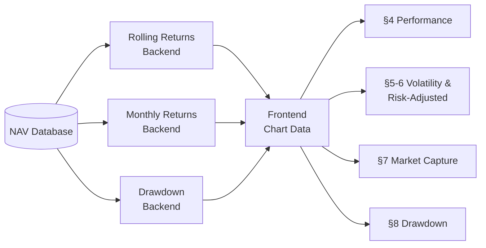
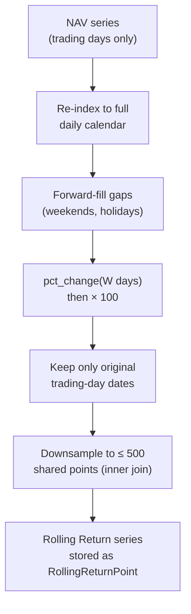
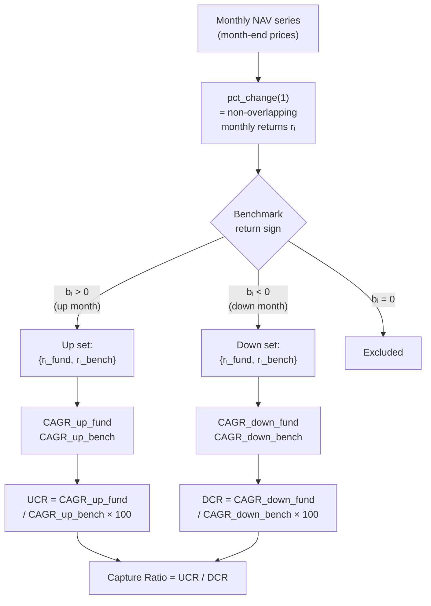
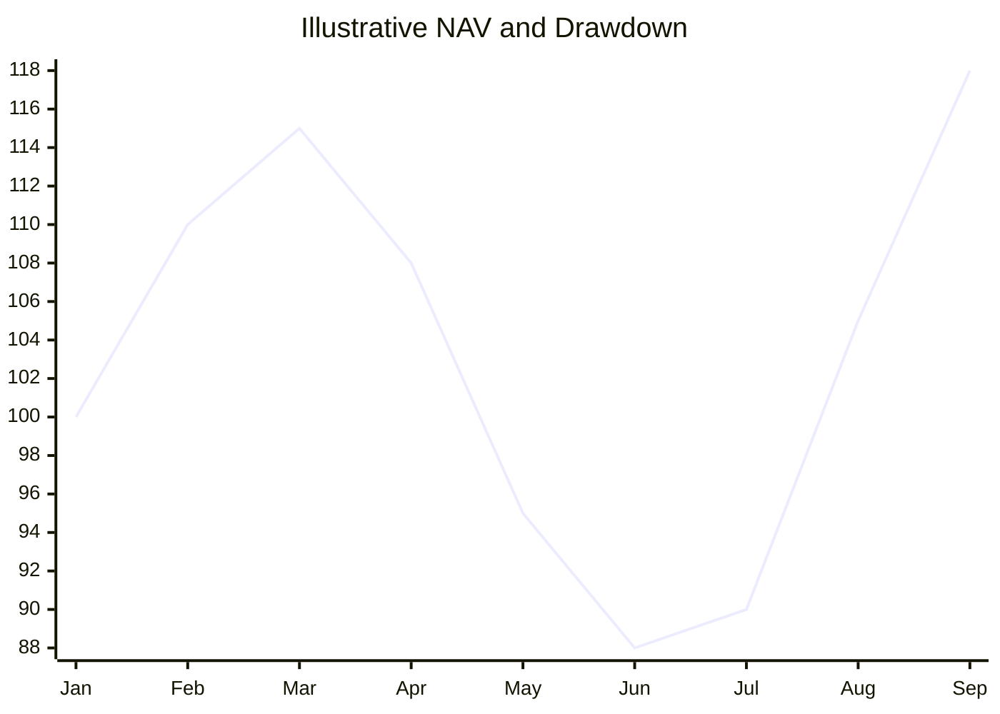
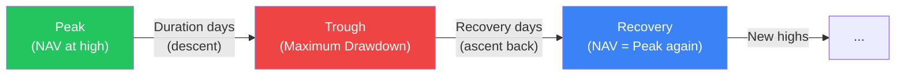
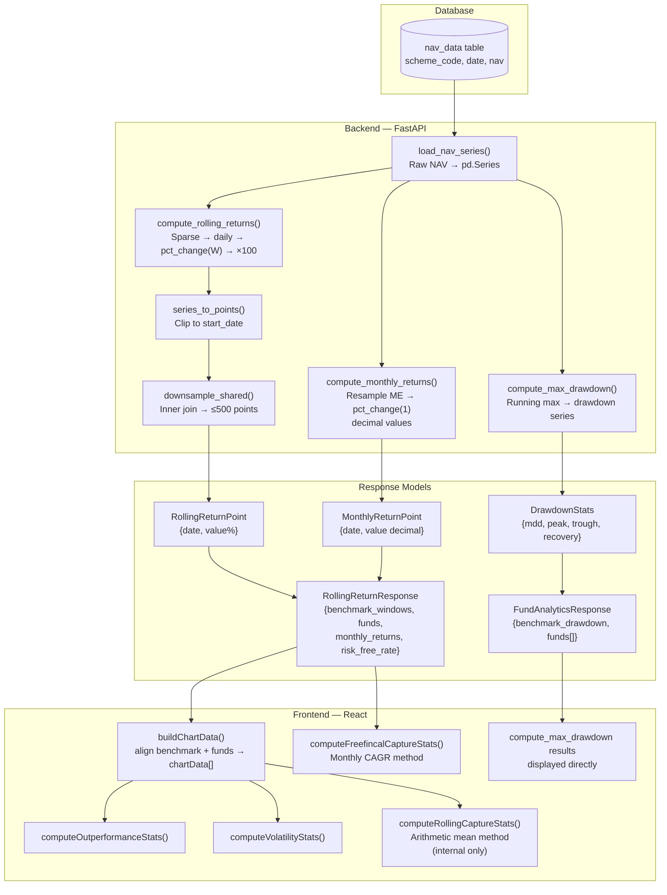
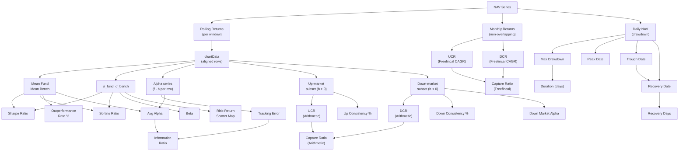

# Metrics Reference — Historical MF Data

> **Audience:** Anyone who wants to understand what the app measures, how each number is computed, and what it means. No prior knowledge of finance theory is assumed; formulas are stated exactly as implemented in the codebase.

---

## Table of Contents

1. [How the App Works — Big Picture](#1-how-the-app-works--big-picture)
2. [Data Foundation — NAV and Rolling Returns](#2-data-foundation--nav-and-rolling-returns)
3. [Return Types — Absolute vs CAGR](#3-return-types--absolute-vs-cagr)
4. [Performance Metrics](#4-performance-metrics)
   - 4.1 [Outperformance Rate (Beat Rate)](#41-outperformance-rate-beat-rate)
   - 4.2 [Average Alpha (Period Alpha)](#42-average-alpha-period-alpha)
5. [Volatility & Risk Metrics](#5-volatility--risk-metrics)
   - 5.1 [Standard Deviation](#51-standard-deviation)
   - 5.2 [Beta](#52-beta)
   - 5.3 [Tracking Error](#53-tracking-error)
6. [Risk-Adjusted Return Metrics](#6-risk-adjusted-return-metrics)
   - 6.1 [Information Ratio](#61-information-ratio)
   - 6.2 [Sharpe Ratio](#62-sharpe-ratio)
   - 6.3 [Sortino Ratio](#63-sortino-ratio)
7. [Market Capture Analysis](#7-market-capture-analysis)
   - 7.1 [UCR — Upside Capture Ratio (Arithmetic Mean)](#71-ucr--upside-capture-ratio-arithmetic-mean)
   - 7.2 [DCR — Downside Capture Ratio (Arithmetic Mean)](#72-dcr--downside-capture-ratio-arithmetic-mean)
   - 7.3 [Capture Ratio](#73-capture-ratio)
   - 7.4 [Up Consistency %](#74-up-consistency-)
   - 7.5 [Down Consistency %](#75-down-consistency-)
   - 7.6 [Down Market Alpha](#76-down-market-alpha)
   - 7.7 [Freefincal-style UCR / DCR (CAGR Method)](#77-freefincal-style-ucr--dcr-cagr-method)
8. [Drawdown Analysis](#8-drawdown-analysis)
   - 8.1 [Maximum Drawdown](#81-maximum-drawdown)
   - 8.2 [Peak and Trough Dates](#82-peak-and-trough-dates)
   - 8.3 [Drawdown Duration](#83-drawdown-duration)
   - 8.4 [Recovery Date and Recovery Days](#84-recovery-date-and-recovery-days)
9. [Observation Period Breakdown](#9-observation-period-breakdown)
10. [Risk-Return Scatter Map](#10-risk-return-scatter-map)
11. [Colour Coding & Thresholds](#11-colour-coding--thresholds)
12. [Data Pipeline Architecture](#12-data-pipeline-architecture)
13. [Metric Dependency Map](#13-metric-dependency-map)
14. [Worked Example](#14-worked-example)
15. [Limitations & Caveats](#15-limitations--caveats)

---

## 1. How the App Works — Big Picture

The app compares up to **5 mutual funds** against a single **benchmark** (typically an index fund tracking Nifty 50, Nifty 500, etc.) over user-selected time windows (1Y, 3Y, 5Y, 10Y).

The core analysis asks three questions:

| Question | Answer section |
|---|---|
| Does the fund keep up with the benchmark? | §4 Performance, §7 Capture |
| Is the fund taking more risk to do so? | §5 Volatility, §6 Risk-adjusted |
| How badly does it fall — and how quickly does it recover? | §8 Drawdown |



---

## 2. Data Foundation — NAV and Rolling Returns

### What is NAV?

NAV (Net Asset Value) is the per-unit price of a mutual fund on a given trading day. It is the raw input to every calculation in the app.

### Rolling Return

A **rolling return** for window $W$ days is the total return earned by holding the fund from exactly $W$ calendar days ago until today:

$$r_t = \frac{\text{NAV}_t}{\text{NAV}_{t - W}} - 1$$

The result is expressed as a **percentage** (e.g. $0.152 \rightarrow 15.2\%$).

**Implementation detail (backend):**

1. The sparse trading-day NAV series is re-indexed onto a full daily calendar and **forward-filled** so that `pct_change(W)` gives the correct calendar-accurate window.
2. Only dates with actual NAV observations (trading days) are kept in the output — no forward-fill artefacts.
3. The series is multiplied by 100 before being stored as `RollingReturnPoint.value` (e.g. `15.2` not `0.152`).



### Window sizes

| Label | Calendar days (`W`) |
|---|---|
| 1Y | 365 |
| 3Y | 1 095 |
| 5Y | 1 825 |
| 10Y | 3 650 |

### Downsampling

All fund and benchmark series for a given window are **inner-joined** on common dates (ensuring every chart row has a value for every series), then reduced to at most **500 evenly-spaced points** via `numpy.linspace`. This is purely a rendering optimisation — all statistical computations are performed on the same shared grid.

### Monthly Returns (for Freefincal method)

A separate, lighter series of **non-overlapping monthly returns** is computed by:

1. Resampling the NAV to the **last trading day of each calendar month** (`resample("ME").last()`).
2. Computing month-over-month `pct_change(1)`.
3. Values are kept as **decimals** (e.g. `0.0312` = +3.12%) — not multiplied by 100 — because the CAGR product formula requires decimal inputs.

These are window-independent: the same monthly series is used regardless of which rolling-window tab is active in the UI.

---

## 3. Return Types — Absolute vs CAGR

The rolling return $r_t$ computed above is a **total absolute return** over the window. The UI offers two display modes:

### Absolute Return

$$R_{\text{abs}} = r_t \times 100 \quad [\%]$$

Interpretation: "If you invested $W$ days ago, your investment grew by this percentage."

### CAGR (Compound Annual Growth Rate)

$$R_{\text{CAGR}} = \left[(1 + r_t)^{\,365/W} - 1\right] \times 100 \quad [\%]$$

Interpretation: "What equivalent annual return rate would produce the same total return over $W$ days?"

CAGR makes 1Y, 3Y and 5Y windows directly comparable on the same axis — a 3Y CAGR of 12% means the same compound annual pace regardless of window length.

### Risk-Free Rate Adjustment

The risk-free rate $r_f$ (default: 6.5% p.a.) must be converted to the same unit as the returns before Sharpe/Sortino calculations:

| Mode | Formula |
|---|---|
| CAGR | $rf\_pct = r_f \times 100$ (same annual %, direct comparison) |
| Absolute | $rf\_pct = \left[(1 + r_f)^{W/365} - 1\right] \times 100$ |

---

## 4. Performance Metrics

These metrics answer: "How often and by how much does the fund beat the benchmark?"

**Input:** The aligned `chartData` array — a sequence of `{date, benchmark, fund_X, ...}` rows where each value is the rolling return (absolute or CAGR %) for that date.

### 4.1 Outperformance Rate (Beat Rate)

For each co-aligned observation pair $(f_i, b_i)$:

- **Outperformed:** $f_i > b_i$
- **Underperformed:** $f_i < b_i$
- **Tied:** $f_i = b_i$

$$\text{Outperformance Rate} = \frac{\text{count}(f_i > b_i)}{N} \times 100 \quad [\%]$$

$$\text{Underperformance Rate} = \frac{\text{count}(f_i < b_i)}{N} \times 100 \quad [\%]$$

where $N$ = total co-aligned observations.

**What it tells you:** The fraction of time the fund would have been "ahead" of the benchmark if you had invested exactly $W$ days before each observation date. Higher is better. 50% means a coin-flip — no edge over the benchmark.

### 4.2 Average Alpha (Period Alpha)

$$\bar{\alpha} = \frac{1}{N} \sum_{i=1}^{N} (f_i - b_i)$$

This is the arithmetic mean of the **excess return** (fund minus benchmark) across all co-aligned rolling-return observations.

**What it tells you:** On average, by how many percentage points did the fund beat (or lag) the benchmark per observation? A positive average alpha means the fund systematically delivered more than the benchmark over the chosen window. A negative alpha means the reverse.

> **Note on overlapping windows:** Because rolling returns overlap (each consecutive pair of observations shares almost all the same days), $N$ can be several hundred while representing less than a single window's worth of independent data. Average alpha is most useful for **relative comparison** between funds, not as a standalone absolute claim.

---

## 5. Volatility & Risk Metrics

### 5.1 Standard Deviation

Standard deviation measures the **dispersion** of rolling returns around their mean. A higher σ means returns fluctuate more widely — higher risk.

$$\sigma = \sqrt{\frac{\sum_{i=1}^{N}(x_i - \bar{x})^2}{N-1}}$$

The app uses the **sample** standard deviation (denominator $N-1$, Bessel's correction).

Both fund and benchmark σ are computed:

$$\sigma_{\text{fund}} = \text{StdDev}(\{f_1, f_2, \ldots, f_N\})$$

$$\sigma_{\text{bench}} = \text{StdDev}(\{b_1, b_2, \ldots, b_N\})$$

**What it tells you:** If two funds have similar average returns but different σ, the lower-σ fund is delivering the same result with less volatility — preferable for most investors.

### 5.2 Beta

Beta measures how much the fund's return moves for every unit of benchmark return. It quantifies **systematic risk exposure**.

$$\text{Beta} = \frac{\text{Cov}(f, b)}{\text{Var}(b)}$$

where:

$$\text{Cov}(f, b) = \frac{\sum_{i=1}^{N}(f_i - \bar{f})(b_i - \bar{b})}{N-1}$$

$$\text{Var}(b) = \sigma_{\text{bench}}^2$$

| Beta value | Interpretation |
|---|---|
| $= 1.0$ | Fund moves in lockstep with the benchmark |
| $> 1.0$ | Fund amplifies benchmark moves (higher risk, higher potential return) |
| $< 1.0$ | Fund is less sensitive to benchmark swings (more defensive) |
| $< 0$ | Fund moves in the opposite direction to the benchmark |

**Colour coding in the UI:** β > 1.1 → amber (elevated risk), β < 0.9 → blue (defensive), 0.9–1.1 → neutral gray.

### 5.3 Tracking Error

Tracking Error is the **standard deviation of the alpha series** — how consistently the fund's excess return stays near its average.

$$\text{TE} = \sigma(\{f_i - b_i\})$$

**What it tells you:** A low TE means the fund closely follows the benchmark (useful for index funds — you want TE ≈ 0 for a pure tracker). A high TE means the fund's excess return is unpredictable — it swings widely above and below the benchmark.

---

## 6. Risk-Adjusted Return Metrics

### 6.1 Information Ratio

The Information Ratio (IR) measures the **quality of active management**: how much average alpha does the fund generate per unit of tracking-error risk?

$$\text{IR} = \frac{\bar{\alpha}}{\text{TE}} = \frac{\overline{(f_i - b_i)}}{\sigma(\{f_i - b_i\})}$$

| IR range | Interpretation |
|---|---|
| ≥ 1.0 | Excellent — high alpha, well-controlled active risk |
| 0.5–1.0 | Good |
| 0.0–0.5 | Marginal |
| < 0 | Fund destroys value vs. benchmark |

**Colour coding in the UI:** ≥ 1.0 → emerald, 0.5–1.0 → blue, 0–0.5 → gray, < 0 → rose.

### 6.2 Sharpe Ratio

The Sharpe Ratio measures **excess return per unit of total volatility**. It answers: "Am I being rewarded enough for the risk I'm taking?"

$$\text{Sharpe} = \frac{\bar{r} - r_f}{\sigma}$$

where $\bar{r}$ is the mean rolling return of the fund (or benchmark), $r_f$ is the risk-free rate in the same unit (see §3), and $\sigma$ is the standard deviation of returns.

Both fund and benchmark Sharpe are computed and displayed side-by-side so you can judge whether the fund has a better risk-adjusted profile than simply holding the benchmark.

**Interpretation:** Higher is better. A Sharpe > 1 is generally considered good. A fund with a lower Sharpe than the benchmark is not compensating investors for the extra volatility it introduces.

### 6.3 Sortino Ratio

The Sortino Ratio is a refinement of Sharpe that penalises only **downside volatility** (returns below the risk-free rate), not all volatility. Upward swings are not counted as "bad" risk.

$$\sigma_{\text{downside}} = \text{StdDev}\bigl(\{r_i : r_i < r_f\}\bigr)$$

$$\text{Sortino} = \frac{\bar{r} - r_f}{\sigma_{\text{downside}}}$$

**Why Sortino over Sharpe?** An investor cares about periods where returns are _below_ the risk-free rate (actual losses of purchasing power), not periods where returns are _above_ average. Sortino better captures investor discomfort.

**Comparison logic:**
- If a fund has a higher Sortino than its Sharpe (relative to the benchmark), it means the fund's volatility is mostly on the upside — a good sign.
- Both fund and benchmark Sortino are shown so you can see whether the fund offers better downside protection.

---

## 7. Market Capture Analysis

Market capture analysis splits observations into **up-market** periods (benchmark > 0) and **down-market** periods (benchmark < 0) and measures how the fund behaves in each regime.

**Two methods are implemented:**

| Method | Input | Formula | UI Display |
|---|---|---|---|
| Arithmetic Mean | Rolling-return observations (overlapping) | Mean ratio | **Not displayed** — used only for Down Market Alpha |
| Freefincal CAGR | Monthly returns (non-overlapping) | CAGR product formula | **Primary display** — main UCR/DCR table |

> **Note:** The arithmetic mean method applied to multi-year rolling returns (3Y, 5Y) suffers from a "small denominator problem" — there are few periods where the benchmark is negative, and when it is, the values are small, producing extreme DCR values (e.g., 400+). The Freefincal CAGR method using monthly returns avoids this issue and is now the primary displayed metric.

### 7.1 UCR — Upside Capture Ratio (Arithmetic Mean)

> **⚠️ Not displayed in UI.** This metric is computed internally but no longer shown as a primary metric due to the small-denominator problem with multi-year rolling returns. The Freefincal CAGR method (§7.7) is now the primary displayed metric. This section is retained for reference only.

Filter to observations where $b_i > 0$ (benchmark was positive over that window):

$$\text{UCR} = \frac{\bar{f}^{\,\uparrow}}{\bar{b}^{\,\uparrow}} \times 100$$

where $\bar{f}^{\,\uparrow}$ = mean of fund returns in those up-market periods, $\bar{b}^{\,\uparrow}$ = mean of benchmark returns in those same periods.

| UCR | Interpretation |
|---|---|
| > 100 | Fund captured more than 100% of the benchmark's gains |
| = 100 | Fund matched the benchmark in up markets |
| < 100 | Fund captured less of the benchmark's gains |

### 7.2 DCR — Downside Capture Ratio (Arithmetic Mean)

> **⚠️ Not displayed in UI.** See note in §7.1.

Filter to observations where $b_i < 0$ (benchmark was negative):

$$\text{DCR} = \frac{\bar{f}^{\,\downarrow}}{\bar{b}^{\,\downarrow}} \times 100$$

| DCR | Interpretation |
|---|---|
| < 100 | Fund fell less than the benchmark in down markets — good downside protection |
| = 100 | Fund fell by the same proportion as the benchmark |
| > 100 | Fund amplified losses in down markets — poor downside protection |

> **Why DCR uses the same sign convention:** Both $\bar{f}^{\,\downarrow}$ and $\bar{b}^{\,\downarrow}$ are negative in a down market. Dividing two negatives gives a positive ratio. A DCR of 80 means the fund fell only 80% as much as the benchmark — better.

### 7.3 Capture Ratio

> **⚠️ Not displayed in UI (arithmetic mean version).** The displayed Capture Ratio uses the Freefincal CAGR method (§7.7).

$$\text{Capture Ratio} = \frac{\text{UCR}}{\text{DCR}}$$

This single number summarises asymmetry: did the fund capture more upside than downside?

| Capture Ratio | Interpretation |
|---|---|
| > 1.0 | Fund gained more in up markets than it lost in down markets — **asymmetric advantage** |
| = 1.0 | Symmetric behaviour — proportionally equal up and down capture |
| < 1.0 | Fund captured less upside than downside — unfavourable asymmetry |

**Ideal:** A fund with UCR = 110 and DCR = 80 has a Capture Ratio of 1.375 — it captured 37.5% more upside than downside, a strong profile.

### 7.4 Up Consistency %

Among all up-market periods (benchmark > 0), what fraction did the fund **individually outperform** the benchmark?

$$\text{Up Consistency} = \frac{\text{count}(f_i > b_i \mid b_i > 0)}{\text{count}(b_i > 0)} \times 100$$

**What it tells you:** UCR can be high because the fund dramatically outperforms in a few very large up-months while underperforming the rest. Up Consistency measures whether the fund reliably beats the benchmark in every up period, not just on average. A fund with UCR 110 but Up Consistency 45% is inconsistently beating the benchmark; a fund with UCR 105 and Up Consistency 70% is more reliably doing so.

### 7.5 Down Consistency %

Among all down-market periods (benchmark < 0), what fraction did the fund **fall less** than the benchmark?

$$\text{Down Consistency} = \frac{\text{count}(f_i > b_i \mid b_i < 0)}{\text{count}(b_i < 0)} \times 100$$

> Note: "fund fell less" = fund return > benchmark return (both are negative; a less negative value is larger). E.g. if benchmark is −8% and fund is −5%, then fund > benchmark.

**Colour thresholds for both consistency metrics:**

| Value | Colour |
|---|---|
| ≥ 60% | Emerald (good) |
| 40–60% | Amber (neutral) |
| < 40% | Rose (poor) |

### 7.6 Down Market Alpha

The mean excess return of the fund over the benchmark **specifically in down-market periods**:

$$\text{Down Market Alpha} = \frac{1}{N_{\downarrow}} \sum_{i: b_i < 0} (f_i - b_i)$$

where $N_{\downarrow}$ = number of down-market observations.

**Interpretation:**
- **Positive:** The fund consistently lost less than the benchmark during downturns — downside protection. For active funds this reflects manager skill; for index funds this can reflect lower expense ratio drag.
- **Negative:** The fund amplified losses relative to the benchmark. For passive index funds this is expected to be small and negative (expense ratio drag ≈ −0.1% to −0.5%).

### 7.7 UCR / DCR — Primary Method (Monthly CAGR)

This is the **primary displayed metric** for capture ratios. It uses **non-overlapping monthly returns** and the **CAGR product formula** — matching the methodology used by Freefincal and avoiding the small-denominator problem that affects arithmetic-mean methods on multi-year rolling returns.



**Step 1 — Monthly returns**

The NAV series is resampled to month-end (last trading day of each calendar month) and month-over-month returns are computed:

$$r_i = \frac{\text{NAV}_{\text{month-end}(i)}}{\text{NAV}_{\text{month-end}(i-1)}} - 1$$

Values are decimal (e.g. $0.0312 = +3.12\%$).

**Step 2 — Filter and CAGR**

For the filtered set of $n$ months, the CAGR is computed using the **geometric product**:

$$\text{CAGR} = \left[\prod_{i=1}^{n}(1 + r_i)\right]^{12/n} - 1$$

This is equivalent to: "What constant monthly compounding rate, applied for $n$ months, produces the same cumulative return as the actual months?"

**Step 3 — Ratios**

$$\text{UCR}_{\text{FF}} = \frac{\text{CAGR}^{\uparrow}_{\text{fund}}}{\text{CAGR}^{\uparrow}_{\text{bench}}} \times 100$$

$$\text{DCR}_{\text{FF}} = \frac{\text{CAGR}^{\downarrow}_{\text{fund}}}{\text{CAGR}^{\downarrow}_{\text{bench}}} \times 100$$

$$\text{Capture Ratio}_{\text{FF}} = \frac{\text{UCR}_{\text{FF}}}{\text{DCR}_{\text{FF}}}$$

**Why does this differ from the arithmetic mean method?**

| Dimension | Arithmetic Mean | Freefincal CAGR |
|---|---|---|
| Input | Overlapping rolling-return observations | Non-overlapping monthly returns |
| Averaging | Simple mean of individual period returns | Geometric (compound) average |
| Window dependency | Changes with active tab (1Y / 3Y / etc.) | Window-independent (uses full monthly history within selected date range) |
| Numeric match | Morningstar-style convention | Freefincal published methodology |
| Serial correlation | High (highly overlapping observations) | None (non-overlapping months) |

The Freefincal CAGR table is the primary displayed metric; use it for capture ratio analysis.

---

## 8. Drawdown Analysis

Drawdown analysis operates directly on the **raw NAV series** (not rolling returns) and is computed by the backend.

### 8.1 Maximum Drawdown

The Maximum Drawdown (MDD) is the largest peak-to-trough decline in NAV value, expressed as a percentage of the peak:

$$\text{Running Maximum}_t = \max_{s \leq t}\text{NAV}_s$$

$$\text{Drawdown}_t = \frac{\text{NAV}_t - \text{Running Maximum}_t}{\text{Running Maximum}_t} \leq 0$$

$$\text{MDD} = \min_t \text{Drawdown}_t \times 100 \quad [\%]$$

The result is always negative or zero (e.g. $-38.5\%$ means the fund fell 38.5% from its peak).

**What it tells you:** MDD is the worst-case loss an investor would have experienced had they bought at exactly the peak and measured at exactly the trough. It is a key measure of **tail risk** and psychological pain tolerance.



### 8.2 Peak and Trough Dates

- **Peak Date:** The last date the NAV reached its running all-time high **before** the trough. Formally: `nav[:trough_date].idxmax()`.
- **Trough Date:** The date at which the maximum drawdown occurred. Formally: `drawdown_series.idxmin()`.

### 8.3 Drawdown Duration

$$\text{Duration} = \text{Trough Date} - \text{Peak Date} \quad [\text{calendar days}]$$

This measures how long the decline lasted. A short duration with a large MDD indicates a sharp crash (e.g. COVID-19 in March 2020). A long duration with a moderate MDD indicates a slow grind downward (e.g. extended bear markets).

### 8.4 Recovery Date and Recovery Days

- **Recovery Date:** The first date after the trough where $\text{NAV} \geq \text{NAV}_{\text{peak}}$. `None` if the NAV has not yet recovered within the selected date range.
- **Recovery Days:** $\text{Recovery Date} - \text{Trough Date}$ in calendar days.



**UI colour coding:**
- Recovery Date present → emerald text
- Not yet recovered → amber "Not recovered"

---

## 9. Observation Period Breakdown

> **Note:** The separate "Observation Period Breakdown" table has been removed from the UI. Up/down month counts are now displayed inline in the primary Upside/Downside Capture table (§7.7).

This section documents the underlying data for transparency:

| Column | Definition |
|---|---|
| Total Observations | All co-aligned rolling-return observation pairs $(f_i, b_i)$ where neither is null |
| Up-Market Periods | Count of observations where benchmark > 0 |
| Down-Market Periods | Count of observations where benchmark < 0 |

**Why it matters:** UCR and DCR are meaningless without knowing how many up/down periods contributed. A UCR of 120 based on 5 up-market observations is statistically unreliable; based on 200 observations it is meaningful. The Freefincal table also shows Up Months and Down Months for the same reason.

> Observations where benchmark = 0 exactly are excluded from both up and down counts but are included in the total (they contribute to outperformance/volatility calculations).

---

## 10. Risk-Return Scatter Map

The Risk-Return Map plots each fund and the benchmark as a point in **risk (x-axis) vs. return (y-axis)** space, using the same window and return-type as the active tab.

- **X-axis:** Standard deviation of rolling returns ($\sigma_{\text{fund}}$ or $\sigma_{\text{bench}}$)
- **Y-axis:** Mean rolling return ($\bar{f}$ or $\bar{b}$)
- **Benchmark:** Rendered as a diamond (◆) in green
- **Funds:** Rendered as circles in their respective colours

```mermaid
quadrantChart
    title Risk-Return Map (illustrative)
    x-axis "Low Risk (σ)" --> "High Risk (σ)"
    y-axis "Low Return" --> "High Return"
    quadrant-1 High Return, Low Risk (ideal)
    quadrant-2 High Return, High Risk
    quadrant-3 Low Return, High Risk (worst)
    quadrant-4 Low Return, Low Risk
    Fund A: [0.3, 0.7]
    Fund B: [0.6, 0.8]
    Benchmark: [0.5, 0.5]
```

**How to read it:**
- Points in the **upper-left** quadrant relative to the benchmark are ideal: higher return for less risk.
- Points in the **lower-right** quadrant are the worst: lower return for more risk.
- The Sharpe Ratio is the slope of the line from the origin to each point (after subtracting $r_f$ from the y-axis).

---

## 11. Colour Coding & Thresholds

The app uses consistent colour coding to enable instant visual interpretation.

### Return values (green = good, red = bad)

| Colour | Meaning |
|---|---|
| Emerald / green | Positive (fund gained, fund outperformed) |
| Rose / red | Negative (fund lost, fund underperformed) |
| Gray | Neutral or not applicable |

### Beta

| Range | Colour | Meaning |
|---|---|---|
| > 1.1 | Amber | Elevated systematic risk |
| 0.9–1.1 | Gray | Neutral |
| < 0.9 | Blue | Defensive |

### Information Ratio

| Range | Colour |
|---|---|
| ≥ 1.0 | Emerald |
| 0.5–1.0 | Blue |
| 0.0–0.5 | Gray |
| < 0 | Rose |

### UCR / DCR (both methods)

| Metric | Threshold | Colour |
|---|---|---|
| UCR | ≥ 100 | Emerald (captured benchmark gains) |
| UCR | < 100 | Amber (missed benchmark gains) |
| DCR | ≤ 100 | Emerald (protected in downturns) |
| DCR | > 100 | Rose (amplified losses) |
| Capture Ratio | ≥ 1.0 | Emerald |
| Capture Ratio | < 1.0 | Rose |

### Consistency %

| Range | Colour |
|---|---|
| ≥ 60% | Emerald |
| 40–60% | Amber |
| < 40% | Rose |

### Down Market Alpha

| Value | Colour |
|---|---|
| ≥ 0 | Emerald (fund protected better than benchmark) |
| < 0 | Rose (fund amplified losses) |

---

## 12. Data Pipeline Architecture



### API Endpoints

| Endpoint | Method | Purpose |
|---|---|---|
| `POST /api/performance/rolling-returns` | POST | Returns rolling-return series for all windows + monthly returns |
| `POST /api/performance/fund-analytics` | POST | Returns drawdown statistics |

### Request Parameters

| Parameter | Type | Description |
|---|---|---|
| `scheme_codes` | `int[]` | Up to 5 fund AMFI scheme codes |
| `benchmark_code` | `int` | Benchmark scheme code |
| `windows` | `str[]` | Subset of `["1y","3y","5y","10y"]` |
| `start_date` | `date?` | Analysis start (backend adds look-back buffer for rolling window) |
| `end_date` | `date?` | Analysis end |

---

## 13. Metric Dependency Map

This diagram shows which raw inputs flow into which output metrics:



---

## 14. Worked Example

Suppose we are analysing Fund A vs Nifty 50 over a **3Y window** on **5 observation dates**.

### Raw rolling returns (3Y absolute %)

| Date | Fund A | Nifty 50 |
|---|---|---|
| 2022-01-31 | 45.2% | 38.1% |
| 2022-04-30 | 22.3% | 28.9% |
| 2022-07-31 | −5.1% | −8.3% |
| 2022-10-31 | 12.8% | 15.2% |
| 2023-01-31 | 31.5% | 29.0% |

### Step 1: CAGR conversion (3Y window = 1 095 days)

$$R_{\text{CAGR}} = [(1 + R_{\text{abs}}/100)^{365/1095} - 1] \times 100$$

For Fund A row 1: $[(1.452)^{1/3} - 1] \times 100 = 13.3\%$ p.a.

### Step 2: Average Alpha (absolute mode)

Alphas: $+7.1, -6.6, +3.2, -2.4, +2.5$

$$\bar{\alpha} = \frac{7.1 - 6.6 + 3.2 - 2.4 + 2.5}{5} = \frac{3.8}{5} = +0.76\%$$

### Step 3: Outperformance Rate

Outperformed in rows 1, 3, 5 → 3 out of 5 = **60%**

### Step 4: UCR / DCR (Arithmetic)

Up-market rows (Nifty > 0): rows 1, 2, 4, 5

$$\bar{f}^{\uparrow} = \frac{45.2 + 22.3 + 12.8 + 31.5}{4} = 27.95\%$$

$$\bar{b}^{\uparrow} = \frac{38.1 + 28.9 + 15.2 + 29.0}{4} = 27.80\%$$

$$\text{UCR} = \frac{27.95}{27.80} \times 100 = 100.5$$

Down-market rows (Nifty < 0): row 3

$$\text{DCR} = \frac{-5.1}{-8.3} \times 100 = 61.4$$

$$\text{Capture Ratio} = \frac{100.5}{61.4} = 1.64$$

**Interpretation:** Fund A captured essentially all of the benchmark's upside (UCR ≈ 100) but only 61% of its downside loss — an excellent result. The 1.64 Capture Ratio reflects meaningful asymmetric advantage.

---

## 15. Limitations & Caveats

### Overlapping Rolling Returns

The most important limitation. Because each trading day produces a new observation that overlaps by $W-1$ days with the previous one, consecutive rows in `chartData` are almost entirely correlated. This means:

- The **effective sample size** for statistical purposes is far smaller than the raw observation count.
- Standard deviations, Sharpe ratios, and arithmetic-mean UCR/DCR computed from overlapping windows **understate true uncertainty**.
- All metrics are best used for **relative comparison between funds** (same data, same overlap structure) rather than as absolute standalone estimates.
- The **Freefincal method** (§7.7) avoids this by using non-overlapping monthly returns.

### Single-window metrics are snapshot-dependent

A fund's UCR for the 3Y window tells you about the specific 3Y rolling periods in the selected date range. A different date range will produce different numbers. Always check multiple windows and date ranges before drawing conclusions.

### Risk-free rate

The risk-free rate is fixed at **6.5% p.a.** (configurable in `backend/app/config.py`). This broadly reflects Indian government bond yields. Sharpe and Sortino ratios are sensitive to this choice — a higher $r_f$ makes both ratios smaller.

### Monthly returns and date coverage

The Freefincal UCR/DCR is based on calendar month-end NAVs. If a fund has fewer than 12 months of data, the results will be unreliable. The "Up Months" and "Down Months" counts in the table help assess reliability.

### Max Drawdown is backward-looking

MDD reflects the worst period **within the selected date range**. It does not predict future drawdowns. A fund may have a low historical MDD simply because the selected date range was an unusually calm market period.

### No annualised Sharpe / Sortino

The Sharpe and Sortino ratios in this app are computed on rolling-return observations in their native units (absolute % or CAGR %) — they are **not** annualised. This is appropriate for comparing funds against each other and against the benchmark, but the numeric values are not directly comparable to industry-standard annualised Sharpe ratios reported by mutual fund fact sheets.

---

*This document is auto-generated from code inspection of `frontend/src/components/charts/RollingReturnChart.jsx`, `frontend-ui-concepts/src/shared/utils/chartUtils.js`, `backend/app/services/rolling_returns.py`, and `backend/app/services/analytics.py`. If metrics are added or changed in the codebase, update this document accordingly.*
